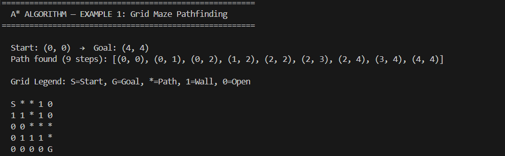
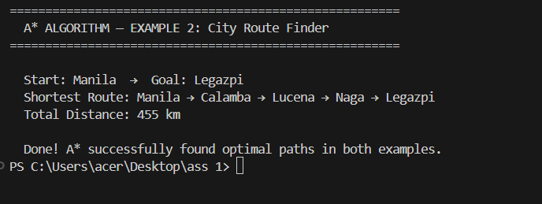
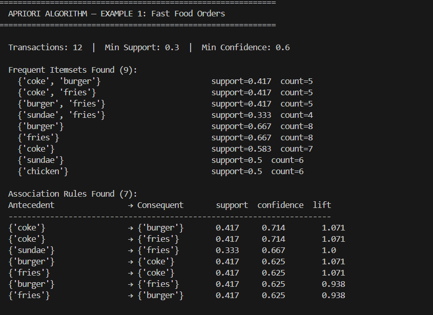
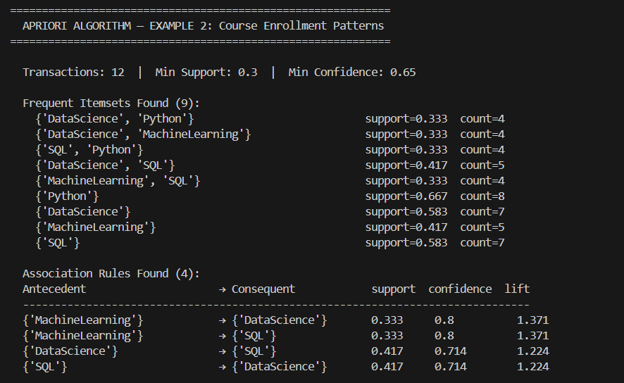
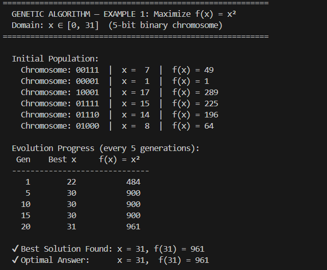
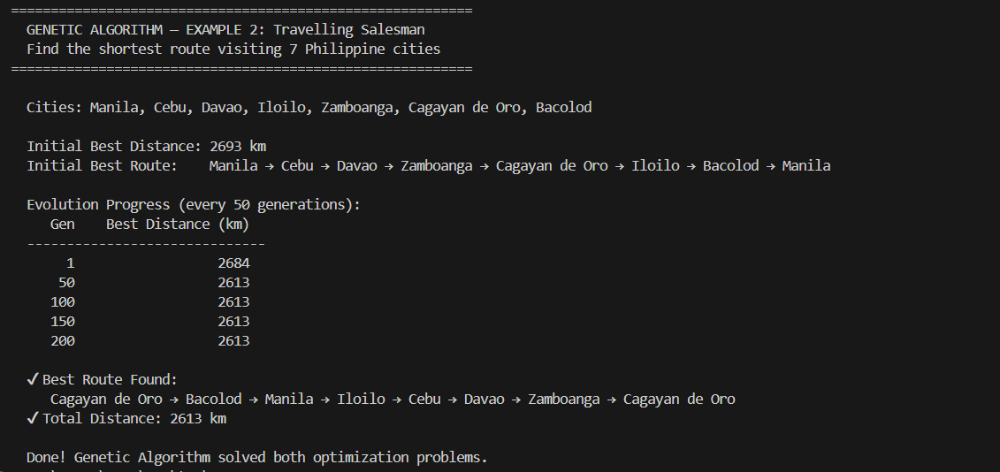

 Algorithm Assignment
A*, Apriori, and Genetic Algorithm

---

 📁 Files

| File | Algorithm | Examples |
|------|-----------|---------|
| `astar.py` | A* Search Algorithm | Grid Maze, City Route Finder |
| `apriori.py` | Apriori Algorithm | Grocery Basket Analysis, Course Enrollment Patterns |
| `genetic_algorithm.py` | Genetic Algorithm | Maximize f(x)=x², Travelling Salesman Problem |

 1.  Algorithm (`astar.py`)

What it is: A best-first search algorithm that finds the shortest path between two nodes using the formula:

f(n) = g(n) + h(n)

`g(n)` = actual cost from start to current node
`h(n)` = heuristic estimate from current node to goal
`f(n)` = total estimated cost

Example 1 – Grid Maze Pathfinding
Finds the shortest path through a 5×5 maze with walls, from (0,0) to (4,4).

Example 2 – City Route Finder
Finds the shortest driving route between Philippine cities (Manila → Legazpi) using road distances as edge weights.

 2. Apriori Algorithm (`apriori.py`)
What it is: A data mining algorithm for Association Rule Learning. It finds frequent itemsets in a transaction database and generates association rules.

Key metrics:
- Support = frequency of itemset in all transactions
- Confidence = how often rule A→B holds
- Lift = how much more likely B is given A (vs. random)

Example 1 – Fast Food Order Analysis
Mines 12 fast food transactions to find what items customers order together (e.g., "if coke → then burger").

Example 2 – Course Enrollment Patterns
Analyzes 12 student enrollments to find which courses are taken together (e.g., "if MachineLearning → then DataScience").

 3. Genetic Algorithm (`genetic_algorithm.py`)

What it is: An evolution-inspired optimization algorithm based on Darwin's natural selection.

Steps:
1. Initialize random population
2. Evaluate fitness
3. Selection (tournament)
4. Crossover (combine parents)
5. Mutation (random changes)
6. Repeat until convergence

Example 1 – Maximize f(x) = x²
Finds x ∈ [0,31] that maximizes f(x) = x² using 5-bit binary chromosomes. Converges to x=31, f(31)=961.

Example 2 – Travelling Salesman Problem (TSP)
Finds the shortest route visiting 7 Philippine cities exactly once and returning to the start.

